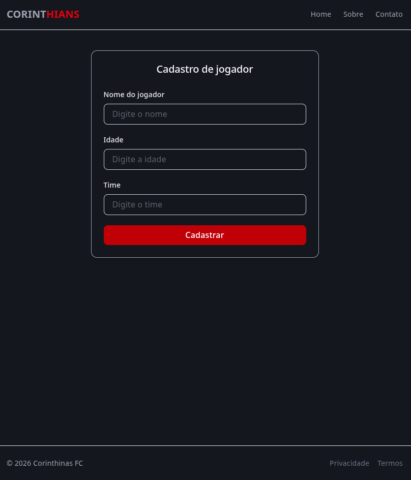

# 🔵 Clonando este repositório:
```
 git clone  git@github.com:tricia-sz/fastAPI_fundamentals.git

``` 

# 🟡 Instalando os pacotes com repo ja clonado
```
  uv sync 

```
# 🟢  Rodando app:
```
  uv run uvicorn --app-dir src main:app --reload 
```

# 🔴 USANDO UV PARA CRIAR PROJETOS DO ZERO 🔴


## 🟣 Iniciando projeto 
```
  uv init nome_do_projeto

```
## 🟣 Projeto com pasta existente
```
 uv init . 

```

## 🟡 Instalando um pacote com uv
```
  uv add nome_do_pacote

```
## 🟡 Instalando fast API e Servidor que ira ouvir o fast UVCorn
```
  uv add fastapi "uvicorn[standard]"
```
