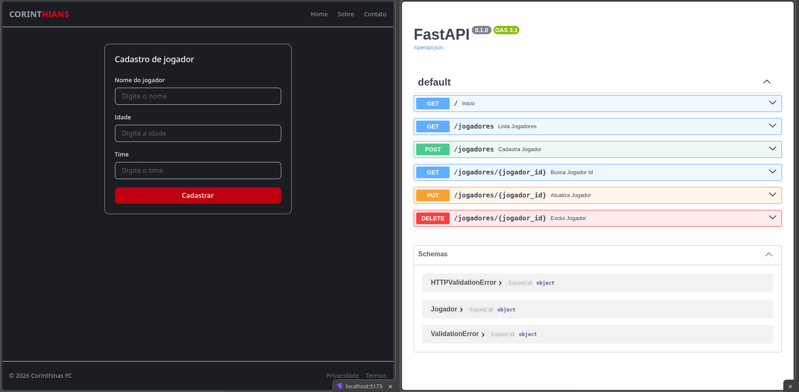

frontend / backend


# ⚽ Sport Blub — Full Stack

## 🛠️ Tecnologias Utilizadas
### Backend
- 🐍 Python
- ⚡ FastAPI
- 🚀 Uvicorn
- 📦 UV
- 🍃 MongoDB

---

# 📋 Pré-requisitos

Antes de começar, certifique-se de ter instalado em sua máquina:

| Tecnologia | Link |
|---|---|
| 🐍 Python | [python.org](https://www.python.org/) |
| ⚡ UV | [docs.astral.sh/uv](https://docs.astral.sh/uv/getting-started/installation/) |
| 🟢 Node.js | [nodejs.org](https://nodejs.org/en/download) |
| 🍃 MongoDB | [mongodb.com](https://www.mongodb.com/) |

> Instale as versões compatíveis com o seu sistema operacional.

---

# 🚀 Executando o projeto

## 01 — Clone o repositório 1 (backend)

No terminal, execute:

```bash
#backend
git clone git@github.com:tricia-sz/sport_blub_fastAPI.git

```

Entre na pasta do projeto:

```bash
cd sport_blub_fastAPI
```

---

# 🐍 Backend

## 02 — Instale as dependências

Na raiz do projeto, execute:

```bash
uv sync
```

O comando irá instalar todas as dependências necessárias para o backend.

---

## 03 — Execute a API

Ainda na raiz do projeto:

```bash
uv run uvicorn --app-dir backend/ api:app --reload
```

Se tudo estiver funcionando corretamente, a API estará disponível em:

```text
http://127.0.0.1:8000
```
---


# 🔌 API — Endpoints

A aplicação possui operações de **CRUD** para gerenciamento de jogadores:

| Método | Endpoint | Descrição |
|:---:|---|---|
| `GET` | `/` | Página inicial da API |
| `GET` | `/jogadores` | Lista todos os jogadores |
| `GET` | `/jogadores/{id}` | Busca um jogador pelo ID |
| `POST` | `/jogadores` | Cadastra um novo jogador |
| `PUT` | `/jogadores/{id}` | Atualiza um jogador |
| `DELETE` | `/jogadores/{id}` | Remove um jogador |

---

# 📁 Estrutura do projeto

```text
sport_blub_fastAPI/
│
├── backend/
│   ├── config/
│   │   └── database.py
│   │
│   ├── models/
│   │   └── jogador.py
│   │
│   ├── routes/
│   │   └── jogador.py
│   │
│   ├── schemas/
│   │   └── jogador.py
│   │
│   └── api.py
│
├── pyproject.toml
├── uv.lock
└── README.md
``` 

# ATENCAO, CASO QUEIRA EXPERIMENTAR A API JUNTO AO FRONT-END, CLONE O REPOSITORIO ABAIXO:


# ⚛️ Frontend

##  — Clone o repositório

No terminal, execute:

```bash
 git clone git@github.com:tricia-sz/sport_blub_frontend.git
```

##  — Acesse a pasta do frontend

Abra **outro terminal** e execute:

```bash
cd sport_blub_frontend
```

---

##  — Instale as dependências

```bash
npm install
```

---

## — Execute o frontend

```bash
npm run dev
```

O frontend estará disponível em:

```text
http://localhost:5173/
```

---

# 💻 MANTER SERVIDORES RODANDO

Para rodar TODO o projeto (front e back), mantenha **dois terminais** abertos.

### Terminal 1 — Backend

Na raiz do projeto:

```bash
uv run uvicorn --app-dir backend/ api:app --reload
```

### Terminal 2 — Frontend

```bash
cd frontend
npm run dev
```

---

By: **Trícia**

[](https://github.com/tricia-sz)

